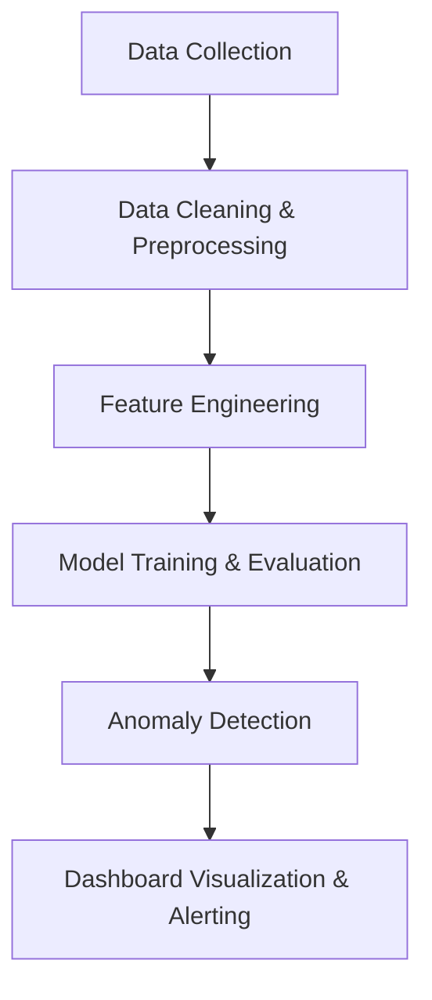

# ⚙️ Fraud or Equipment Malfunction Detection

## 📌 Overview
The **Fraud or Equipment Malfunction Detection** project aims to automatically identify unusual patterns in system operations or transactions that may indicate **fraudulent behavior** or **technical failures**.  
By combining **machine learning**, **data analytics**, and **anomaly detection**, the system helps organizations detect real-time issues — distinguishing between **human-driven fraud** and **machine-driven malfunctions**.

---

## 🎯 Objectives
- Detect irregularities in system or transactional data.  
- Differentiate between fraudulent behavior and sensor or equipment faults.  
- Provide visual insights and alerts for operational teams.  
- Reduce false positives through model-based contextual analysis.

---

## 🧩 Project Workflow



## 🧠 Analytical Approach
| Step                    | Description                                                            |
| ----------------------- | ---------------------------------------------------------------------- |
| **Data Ingestion**      | Collect transaction logs, sensor data, or operational metrics.         |
| **Preprocessing**       | Clean missing data, filter noise, and scale features.                  |
| **Feature Engineering** | Extract key behavioral or machine operation features.                  |
| **Modeling**            | Apply models such as Isolation Forest, Autoencoders, or One-Class SVM. |
| **Evaluation**          | Assess using ROC-AUC, Precision, Recall, and F1 score.                 |
| **Interpretation**      | Visualize anomalies to differentiate fraud vs malfunction.             |


## 🧰 Tech Stack

- **Programming:** Python (Pandas, NumPy, Scikit-learn, TensorFlow)

- **Visualization:** Matplotlib, Seaborn, Plotly

- **Dashboard (optional):** Streamlit or Power BI

- **Storage:** CSV, SQL, or Cloud Storage

- **Deployment (optional):** Flask API or Streamlit Web App

## ⚙️ Folder Structure
```
Fraud_or_Equipment_Malfunction_Detection/
│
├── data/
│   ├── system_data.csv
│   ├── transaction_data.csv
│
├── scripts/
│   ├── load_data.py
│   ├── preprocess_data.py
│   ├── feature_engineering.py
│   ├── train_model.py
│   ├── detect_anomalies.py
│   ├── visualize_results.py
│
├── app/
│   ├── streamlit_app.py
│
├── models/
│   ├── trained_model.pkl
│
├── reports/
│   ├── EDA_Report.ipynb
│
├── README.md
└── requirements.txt
```
## 🧪 Sample Implementation
### 🗂️ scripts/load_data.py

``` python
import pandas as pd

def load_data(file_path):
    """Load sensor or transactional data"""
    df = pd.read_csv(file_path)
    print(f"Loaded dataset with {df.shape[0]} rows and {df.shape[1]} columns.")
    return df
```

### 🧹 scripts/preprocess_data.py

```python
from sklearn.preprocessing import StandardScaler

def preprocess_data(df):
    """Handle missing values and scale features"""
    df = df.fillna(df.mean())
    scaler = StandardScaler()
    scaled = scaler.fit_transform(df.select_dtypes(float))
    return scaled
```


### ⚙️ scripts/train_model.py

```python
from sklearn.ensemble import IsolationForest

def train_model(X):
    """Train anomaly detection model"""
    model = IsolationForest(contamination=0.05, random_state=42)
    model.fit(X)
    return model
```

### 🚨 scripts/detect_anomalies.py

```python
import pandas as pd

def detect_anomalies(model, X, data):
    """Predict anomalies and tag as Fraud or Malfunction"""
    data['anomaly'] = model.predict(X)
    data['label'] = data['anomaly'].map({1: 'Normal', -1: 'Suspicious'})
    return data[data['label'] == 'Suspicious']
```
### 📊 scripts/visualize_results.py

```python
import matplotlib.pyplot as plt

def visualize_results(data):
    """Plot detected anomalies"""
    plt.figure(figsize=(8,5))
    plt.scatter(range(len(data)), data['anomaly'], c=data['anomaly'], cmap='coolwarm')
    plt.title("Detected Anomalies")
    plt.xlabel("Records")
    plt.ylabel("Anomaly Score")
    plt.show()
```

## 📈 Visualization Ideas

- **Time Series Chart:** Highlight spikes or drops in readings/transactions.

- **Anomaly Heatmap:** Cluster anomalies by category or machine ID.

- **Pie Chart:** Fraud vs Equipment-related issue ratio.

- **Dashboard:** Live anomaly monitoring in Streamlit or Power BI.

