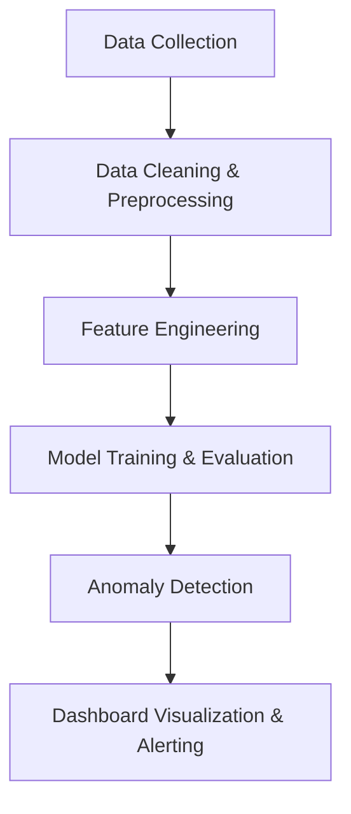

# ⚙️ Fraud or Equipment Malfunction Detection

## 📌 Overview
The **Fraud or Equipment Malfunction Detection** project aims to automatically identify unusual patterns in system operations or transactions that may indicate **fraudulent behavior** or **technical failures**.  
By combining **machine learning**, **data analytics**, and **anomaly detection**, the system helps organizations detect real-time issues — distinguishing between **human-driven fraud** and **machine-driven malfunctions**.

---

## 🎯 Objectives
- Detect irregularities in system or transactional data.  
- Differentiate between fraudulent behavior and sensor or equipment faults.  
- Provide visual insights and alerts for operational teams.  
- Reduce false positives through model-based contextual analysis.

---

## 🧩 Project Workflow

## 🧠 Analytical Approach
| Step                    | Description                                                            |
| ----------------------- | ---------------------------------------------------------------------- |
| **Data Ingestion**      | Collect transaction logs, sensor data, or operational metrics.         |
| **Preprocessing**       | Clean missing data, filter noise, and scale features.                  |
| **Feature Engineering** | Extract key behavioral or machine operation features.                  |
| **Modeling**            | Apply models such as Isolation Forest, Autoencoders, or One-Class SVM. |
| **Evaluation**          | Assess using ROC-AUC, Precision, Recall, and F1 score.                 |
| **Interpretation**      | Visualize anomalies to differentiate fraud vs malfunction.             |

## 🧰 Tech Stack

- **Programming:** Python (Pandas, NumPy, Scikit-learn, TensorFlow)

- **Visualization:** Matplotlib, Seaborn, Plotly

- **Dashboard (optional):** Streamlit or Power BI

- **Storage:** CSV, SQL, or Cloud Storage

- **Deployment (optional):** Flask API or Streamlit Web App

